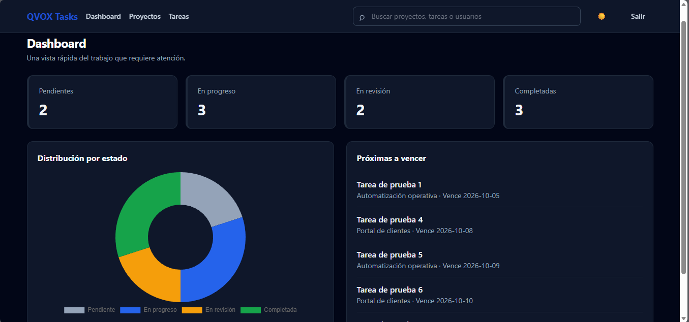
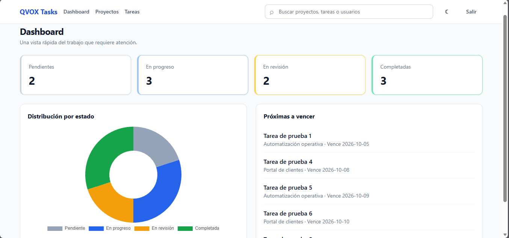

# QVOX Task Manager

Aplicación de gestión de tareas para equipos desarrollada para la prueba técnica Full-Stack de QVOX.

Combina:

- Laravel 13 como backend/API.
- JWT para autenticación.
- Vue 3 + Composition API + TypeScript.
- Inertia.js.
- Tailwind CSS.
- Pinia.
- MySQL 8.
- Laravel Reverb + Laravel Echo para tiempo real.
- Laravel Queue con driver `database`.
- Chart.js.
- Exportación CSV.
- Búsqueda global con debounce.
- Dark mode.
- Kanban con drag & drop.

---

# 0. Capturas de pantalla

## Dashboard — modo oscuro



## Dashboard — modo claro



## 1. Arquitectura

### Backend

- Laravel 13.
- Eloquent ORM.
- Form Requests para validación.
- Policies para autorización.
- Middleware de roles.
- JWT para autenticación.
- Actions para centralizar reglas de negocio.
- Events y Listeners.
- Queue para procesamiento asíncrono.
- Notifications.
- Broadcasting con Laravel Reverb.

### Frontend

- Vue 3.
- Composition API.
- `<script setup lang="ts">`.
- Inertia.js.
- TypeScript con tipado estricto.
- Pinia.
- Tailwind CSS.
- Componentes reutilizables.
- Laravel Echo para tiempo real.

### Base de datos

- MySQL 8.0 o superior.
- `utf8mb4`.
- Claves foráneas.
- Índices en columnas utilizadas para filtros y relaciones.
- Soft deletes para tareas.

La API concentra la validación y autorización. El frontend no sustituye las reglas de permisos del backend.

---

## 2. Requisitos

Antes de comenzar, verificar:

```powershell
php -v
composer --version
node --version
pnpm --version
```

Requisitos mínimos:

- PHP 8.3 o superior.
- Composer 2.
- Node.js 20 o superior.
- pnpm 11 o superior.
- MySQL 8.0 o superior.

Extensiones PHP utilizadas por el proyecto:

- ctype
- curl
- dom
- fileinfo
- json
- mbstring
- openssl
- pdo_mysql
- tokenizer
- xml
- sodium
- zip

---

# 3. Instalación

## 3.1 Clonar el repositorio

```powershell
git clone <URL_DEL_REPOSITORIO>
cd <NOMBRE_DEL_PROYECTO>
```

La rama principal de entrega es:

```text
main
```

---

## 3.2 Crear el archivo `.env`

Copiar el archivo de ejemplo:

```powershell
copy .env.example .env
```

No se debe versionar el archivo `.env`.

---

## 3.3 Verificar la configuración de Reverb

El `.env.example` ya contiene una configuración local funcional para Reverb:

```env
BROADCAST_CONNECTION=reverb

REVERB_APP_ID=qvox-local
REVERB_APP_KEY=qvox-local-key
REVERB_APP_SECRET=change-this-local-secret
REVERB_HOST=127.0.0.1
REVERB_PORT=8080
REVERB_SCHEME=http
REVERB_SERVER_HOST=0.0.0.0
REVERB_SERVER_PORT=8080

VITE_REVERB_APP_KEY="${REVERB_APP_KEY}"
VITE_REVERB_HOST="${REVERB_HOST}"
VITE_REVERB_PORT="${REVERB_PORT}"
VITE_REVERB_SCHEME="${REVERB_SCHEME}"
```

No se requiere una cuenta de Pusher.

---

## 3.4 Instalar dependencias PHP

Ejecutar:

```powershell
composer install
```

El proyecto incluye `composer.lock`, por lo que Composer instalará las versiones bloqueadas de las dependencias.

Si Composer solicita crear directorios de Laravel que no existan, verificar que exista:

```text
bootstrap/cache
```

En un clone limpio puede crearse con:

```powershell
New-Item -ItemType Directory -Path ".\bootstrap\cache" -Force
```

---

## 3.5 Generar la clave de Laravel

```powershell
php artisan key:generate
```

---

## 3.6 Generar el secreto JWT

```powershell
php artisan jwt:secret
```

Esto genera `JWT_SECRET` en el archivo `.env`.

No compartir ni versionar el valor generado.

---

# 4. Configurar MySQL

La aplicación utiliza MySQL.

Crear la base de datos:

```sql
CREATE DATABASE qvox_tasks
CHARACTER SET utf8mb4
COLLATE utf8mb4_unicode_ci;
```

Configurar el `.env`:

```env
DB_CONNECTION=mysql
DB_HOST=127.0.0.1
DB_PORT=3306
DB_DATABASE=qvox_tasks
DB_USERNAME=root
DB_PASSWORD=
```

Si el usuario MySQL utiliza contraseña, colocarla en `DB_PASSWORD`.

Verificar que MySQL esté ejecutándose en el puerto `3306`.

Por ejemplo:

```powershell
Get-NetTCPConnection -LocalPort 3306
```

---

# 5. Migraciones y datos de prueba

Ejecutar:

```powershell
php artisan migrate --seed
```

Esto crea las tablas y carga los datos de prueba mediante factories y seeders.

Para reconstruir completamente la base de datos durante desarrollo:

```powershell
php artisan migrate:fresh --seed
```

> `migrate:fresh --seed` elimina las tablas existentes. Utilizarlo únicamente cuando sea necesario reinicializar la base de datos.

---

# 6. Instalar dependencias frontend

Instalar utilizando el lockfile:

```powershell
pnpm install --frozen-lockfile
```

Si pnpm muestra:

```text
ERR_PNPM_IGNORED_BUILDS
Ignored build scripts: esbuild
```

autorizar el build de `esbuild`:

```powershell
pnpm approve-builds
```

Seleccionar:

```text
esbuild
```

y confirmar.

Después ejecutar:

```powershell
pnpm rebuild esbuild
```

---

# 7. Verificar el frontend

Ejecutar el chequeo de tipos y build de producción:

```powershell
pnpm build
```

El comando ejecuta:

```text
vue-tsc --noEmit
vite build
```

El build genera los archivos en:

```text
public/build
```

---

# 8. Ejecución local

Para utilizar todas las funcionalidades del proyecto se recomienda utilizar cuatro terminales PowerShell abiertas en la raíz del proyecto.

## Terminal 1 — Laravel

```powershell
php artisan serve
```

Backend:

```text
http://127.0.0.1:8000
```

---

## Terminal 2 — Vite

```powershell
pnpm dev
```

Frontend:

```text
http://localhost:5173
```

---

## Terminal 3 — Queue Worker

```powershell
php artisan queue:work
```

El worker procesa los trabajos pendientes de la cola `database`, incluyendo el listener asociado al cambio de estado de las tareas.

---

## Terminal 4 — Laravel Reverb

```powershell
php artisan reverb:start
```

Reverb queda disponible localmente en:

```text
127.0.0.1:8080
```

---

# 9. Acceso a la aplicación

Con Laravel y Vite ejecutándose, abrir:

```text
http://localhost:5173
```

Credenciales de prueba:

| Rol | Correo | Contraseña |
|---|---|---|
| Admin | `admin@qvox.local` | `password` |
| Member | `mateo@qvox.local` | `password` |
| Member | `sofia@qvox.local` | `password` |

---

# 10. Funcionalidades principales

## Autenticación

- Login mediante JWT.
- Logout.
- Consulta del usuario autenticado.
- Control de acceso por rol.
- Rate limiting para login.

## Proyectos

- Listado.
- Búsqueda.
- Filtro por estado.
- Creación para administradores.
- Edición para administradores.
- Archivado/eliminación para administradores.

## Tareas

- Creación.
- Edición.
- Eliminación.
- Asignación.
- Filtros.
- Paginación.
- Cambio de estado.
- Soft deletes.
- Fecha de vencimiento.
- Prioridad.
- Exportación CSV.

## Comentarios

- Agregar comentarios a tareas.
- Control de autorización.

## Actividad

Los cambios de estado generan:

```text
TaskStatusChanged
        ↓
Listener en cola
        ├── Activity Log
        └── Notification
```

---

# 11. Transiciones de estado

Las transiciones de tareas se centralizan en la acción:

```text
app/Actions/ChangeTaskStatus.php
```

Transiciones permitidas:

```text
pendiente
    ↓
en_progreso

en_progreso
    ├── pendiente
    └── en_revision

en_revision
    ├── en_progreso
    └── completada

completada
    └── en_revision
```

No se permite pasar directamente de:

```text
pendiente → completada
```

Al completar una tarea se establece `completed_at`.

Cuando una tarea vuelve a un estado abierto, `completed_at` se limpia.

El evento solamente se publica cuando el estado realmente cambia.

---

# 12. Autorización

## Administrador

Puede:

- Administrar proyectos.
- Crear tareas.
- Asignar tareas.
- Eliminar tareas.
- Consultar los registros permitidos por la aplicación.
- Administrar usuarios según las políticas implementadas.

## Member

Puede:

- Consultar sus tareas asignadas.
- Actualizar sus tareas permitidas.
- Cambiar el estado de sus tareas.
- Agregar comentarios autorizados.

Las Policies y middleware protegen los recursos en backend. Las reglas de autorización no dependen del frontend.

---

# 13. Funcionalidades adicionales / Bonus

La entrega incluye las funcionalidades adicionales contempladas en la prueba:

### Tiempo real

Laravel Reverb + Laravel Echo.

Los cambios de estado se transmiten mediante canales privados de proyecto:

```text
projects.{projectId}
```

El Kanban puede actualizarse sin recargar la página.

### Dashboard

Incluye estadísticas visuales mediante:

```text
Chart.js
```

### Exportación

Las tareas pueden exportarse a CSV.

La exportación utiliza procesamiento streaming con `cursor()` para evitar cargar todo el resultado en memoria.

### Búsqueda global

Incluye búsqueda de:

- Proyectos.
- Tareas.
- Usuarios.

La búsqueda del frontend utiliza debounce de 300 ms.

### Dark mode

El tema oscuro se mantiene mediante `localStorage`.

### Kanban

El tablero permite drag & drop.

El cambio de estado utiliza el mismo endpoint de transición del backend, por lo que el Kanban no puede saltarse las reglas de negocio.

---

# 14. API principal

| Método | Ruta | Descripción |
|---|---|---|
| POST | `/login` | Genera el token JWT |
| POST | `/api/logout` | Invalida el token actual |
| GET | `/api/auth/me` | Usuario autenticado |
| GET | `/api/projects` | Lista proyectos |
| POST | `/api/projects` | Crea proyecto |
| GET | `/api/projects/{project}` | Consulta proyecto |
| PUT/PATCH | `/api/projects/{project}` | Actualiza proyecto |
| DELETE | `/api/projects/{project}` | Archiva/elimina proyecto |
| GET | `/api/projects/{project}/tasks` | Tareas del proyecto |
| GET | `/api/tasks` | Lista tareas con filtros |
| POST | `/api/tasks` | Crea tarea |
| GET | `/api/tasks/{task}` | Consulta tarea |
| PUT/PATCH | `/api/tasks/{task}` | Actualiza tarea |
| DELETE | `/api/tasks/{task}` | Elimina tarea |
| PATCH | `/api/tasks/{task}/status` | Cambia estado |
| POST | `/api/tasks/{task}/comments` | Agrega comentario |
| GET | `/api/tasks/export` | Exporta tareas a CSV |
| GET | `/api/search?q=...` | Búsqueda global |
| GET | `/api/dashboard/stats` | Estadísticas del dashboard |
| GET | `/api/users` | Usuarios |

---

# 15. Autenticación de la API

El login se realiza mediante:

```text
POST /login
```

Ejemplo:

```json
{
    "email": "admin@qvox.local",
    "password": "password"
}
```

Los endpoints protegidos utilizan autenticación JWT.

El token se envía mediante:

```text
Authorization: Bearer <JWT>
```

---

# 16. Tests

El proyecto contiene pruebas Feature para:

- Creación de tareas.
- Validación de datos de tareas.
- Transición válida de estado.
- Rechazo de transición inválida.
- Autorización de proyectos.
- Autorización de comentarios.

Ejecutar:

```powershell
php artisan test
```

Antes de ejecutar los tests, verificar que el entorno de pruebas y la base de datos utilizados por Laravel estén correctamente configurados.

---

# 17. Estructura relevante

```text
app/
├── Actions/
├── Events/
├── Listeners/
├── Http/
│   ├── Controllers/
│   ├── Middleware/
│   ├── Requests/
│   └── Resources/
├── Models/
├── Notifications/
├── Policies/
└── Providers/

database/
├── factories/
├── migrations/
└── seeders/

resources/
└── js/
    ├── Components/
    ├── Composables/
    ├── Layouts/
    ├── Pages/
    ├── Stores/
    └── types/

routes/
├── api.php
├── channels.php
└── web.php

tests/
└── Feature/
```

---

# 18. Decisiones técnicas

### JWT

Se utiliza `php-open-source-saver/jwt-auth` para implementar autenticación JWT en lugar de construir manualmente el manejo de tokens.

### Actions

La lógica de transición de estado se centraliza en:

```text
ChangeTaskStatus
```

Esto evita duplicar reglas entre controladores, Kanban y eventos.

### Policies

La autorización se mantiene en backend mediante Policies y middleware.

### Form Requests

Las validaciones de entrada se mantienen fuera de los controladores utilizando Form Requests.

### Queue

Se utiliza el driver `database` para mantener la ejecución local sin depender de Redis u otros servicios externos.

### Mail

El correo utiliza el driver `log` para desarrollo local y pruebas sin requerir credenciales SMTP externas.

### CSV

La exportación utiliza CSV nativo y `cursor()` para reducir el consumo de memoria.

### Tiempo real

Reverb se utiliza como servidor WebSocket local y Echo como cliente para recibir actualizaciones en tiempo real.

---

# 19. Solución de problemas

## JWT: `Key cannot be empty`

Ejecutar:

```powershell
php artisan jwt:secret
```

Después:

```powershell
php artisan optimize:clear
```

---

## `Rate limiter [login] is not defined`

Verificar que `App\Providers\AppServiceProvider` registre el limiter `login`.

Después ejecutar:

```powershell
php artisan optimize:clear
```

---

## Error durante `composer install` relacionado con `bootstrap/cache`

Crear el directorio:

```powershell
New-Item -ItemType Directory -Path ".\bootstrap\cache" -Force
```

Después:

```powershell
composer install
```

---

## Error de conexión MySQL

Verificar:

```env
DB_HOST=127.0.0.1
DB_PORT=3306
DB_DATABASE=qvox_tasks
DB_USERNAME=root
DB_PASSWORD=
```

Y comprobar que MySQL esté escuchando en el puerto 3306:

```powershell
Get-NetTCPConnection -LocalPort 3306
```

---

## `ERR_PNPM_IGNORED_BUILDS`

Ejecutar:

```powershell
pnpm approve-builds
```

Seleccionar:

```text
esbuild
```

Después:

```powershell
pnpm rebuild esbuild
```

Y volver a ejecutar:

```powershell
pnpm build
```

---

## Limpiar cachés de Laravel

Si se modifican variables de entorno o configuración:

```powershell
php artisan optimize:clear
```

---

# 20. Comandos útiles

### Estado de Laravel

```powershell
php artisan about
```

### Rutas

```powershell
php artisan route:list
```

### Estado de migraciones

```powershell
php artisan migrate:status
```

### Reinicializar base de datos

```powershell
php artisan migrate:fresh --seed
```

### Ejecutar tests

```powershell
php artisan test
```

### Build frontend

```powershell
pnpm build
```

### Desarrollo frontend

```powershell
pnpm dev
```

---

# 21. Git

La rama principal de entrega es:

```text
main
```

Se recomienda mantener commits pequeños, descriptivos y relacionados con una única responsabilidad.

No deben versionarse:

```text
.env
/vendor
/node_modules
```

Sí deben versionarse:

```text
composer.json
composer.lock
package.json
pnpm-lock.yaml
.env.example
```

---

# 22. Flujo completo de instalación rápida

Para una instalación desde cero:

```powershell
git clone <URL_DEL_REPOSITORIO>
cd <NOMBRE_DEL_PROYECTO>

copy .env.example .env

composer install

php artisan key:generate
php artisan jwt:secret

pnpm install --frozen-lockfile

php artisan migrate --seed

pnpm build
```

Después iniciar los servicios:

### Terminal 1

```powershell
php artisan serve
```

### Terminal 2

```powershell
pnpm dev
```

### Terminal 3

```powershell
php artisan queue:work
```

### Terminal 4

```powershell
php artisan reverb:start
```

Abrir:

```text
http://localhost:5173
```

Credencial administrativa:

```text
admin@qvox.local
password
```

---

## Licencia

Proyecto desarrollado como entrega de prueba técnica para QVOX.
